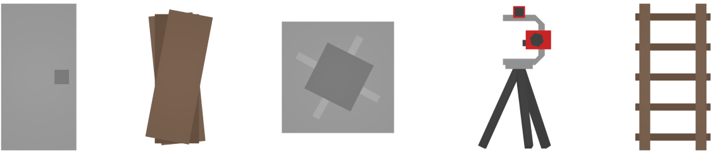

Barricades settings can adjust the decay time and armor of barricades, as well as restrict placement on vehicles.

```json
"Barricades": {
  "Decay_Time": 604800,
  "Armor_Lowtier_Multiplier": 1.0,
  "Armor_Hightier_Multiplier": 0.5,
  "Gun_Lowcal_Damage_Multiplier": 1.0,
  "Gun_Highcal_Damage_Multiplier": 1.0,
  "Melee_Damage_Multiplier": 1.0,
  "Melee_Repair_Multiplier": 1.0,
  "Allow_Item_Placement_On_Vehicle": true,
  "Allow_Trap_Placement_On_Vehicle": true,
  "Max_Item_Distance_From_Hull": 64.0,
  "Max_Trap_Distance_From_Hull": 16.0
}
```

### Work in progress
We are still working on this page. If you have any suggestions or would like to contribute, please let us know!