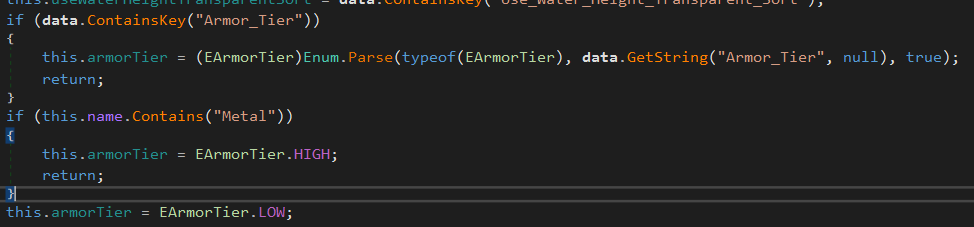
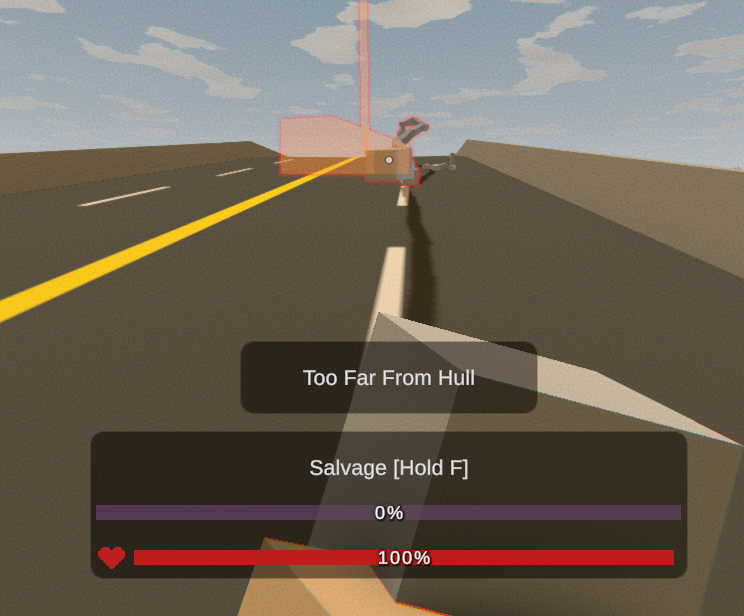
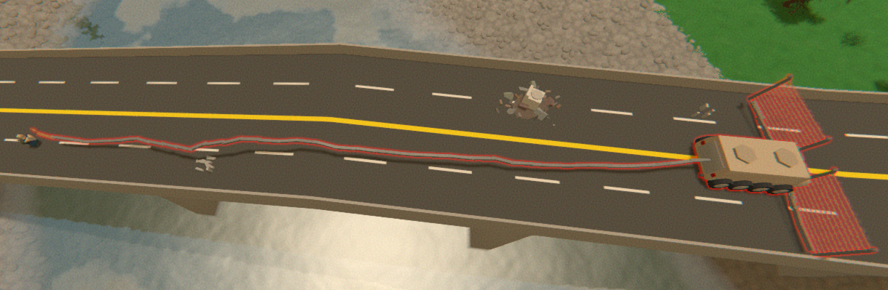
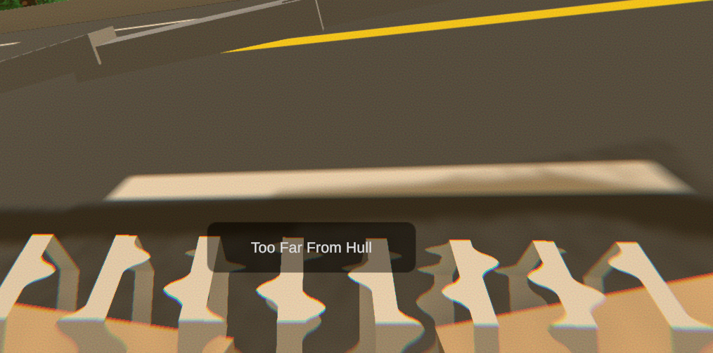

Barricades settings can adjust the decay time and armor of barricades, as well as restrict placement on vehicles.

Based on [Official Unturned Wiki](https://unturned.wiki.gg/wiki/Gameplay_config#Barricades) and our experience.

```json
"Barricades": {
  "Decay_Time": 604800,
  "Armor_Lowtier_Multiplier": 1.0,
  "Armor_Hightier_Multiplier": 0.5,
  "Gun_Lowcal_Damage_Multiplier": 1.0,
  "Gun_Highcal_Damage_Multiplier": 1.0,
  "Melee_Damage_Multiplier": 1.0,
  "Melee_Repair_Multiplier": 1.0,
  "Allow_Item_Placement_On_Vehicle": true,
  "Allow_Trap_Placement_On_Vehicle": true,
  "Max_Item_Distance_From_Hull": 64.0,
  "Max_Trap_Distance_From_Hull": 16.0
}
```

### Decay_Time
The time in seconds it takes for a barricade to decay. The default is **604800** seconds (1 week).

Works the same way as `Decay_Time` of structures.

If owner of the barricade didn't join the server for a `Decay_Time`, the barricade will not be loaded on the next server restart. When server is loading barricades it checks if the owner was online in the last `Decay_Time`. If not, the barricade is not loaded and removed.

### Armor_Lowtier_Multiplier
Damage multiplier for low-tier barricades such as those made from wood like plates, barbed wire and sandbags.

The lower the multiplier, the less damage the barricade will take. For example, if the multiplier is set to **0.5**, the barricade will take half the damage it would normally take.

> **💡 PRO TIP**
> The equation of how multipliers work is:  
> ```damage = damage * multiplier```

### Armor_Hightier_Multiplier
Damage multiplier for high-tier barricades. If barricade contains "Metal" in its name, it is considered high-tier.



### Gun_Lowcal_Damage_Multiplier
Damage multiplier for low-caliber guns. Low-caliber guns are for example: Eaglefire, Cobra, Schofield, etc.

```
damage = damage * Gun_Lowcal_Damage_Multiplier
```

### Gun_Highcal_Damage_Multiplier
Damage multiplier for high-caliber guns. High-caliber guns are for example: Timberwolf, Grizzly, Dragonfang, etc.

For example setting this to **0.75** will cause Dragonfang to deal `0.75 * 30 = 22.5` damage to barricades.

### Melee_Damage_Multiplier
Damage multiplier for melees.

For example when someone uses a Military Knife to destroy a Bedroll, the damage will be multiplied by this value.

### Melee_Repair_Multiplier
Repair multiplier for Blowtorch and other repair tools.

For example when someone uses a Blowtorch to repair a Metal Door, the repair will be multiplied by this value. So you can make Blowtorch faster or slower.

### Allow_Item_Placement_On_Vehicle
Should players be able to place items on vehicles? If set to `false`, players will not be able to place items on vehicles.

### Allow_Trap_Placement_On_Vehicle
Should players be able to place traps on vehicles? If set to `false`, players will not be able to place traps on vehicles.

If you have disabled `Allow_Item_Placement_On_Vehicle`, then this setting will not have any effect, as traps are items.

You might wanna disable this setting if you don't want players to build Barbed Wire Fence on their vehicles. 💀

### Max_Item_Distance_From_Hull
The maximum distance from the vehicle's hull that items can be placed. The default is **64.0** meters.





### Max_Trap_Distance_From_Hull
The maximum distance from the vehicle's hull that traps can be placed. The default is **16.0**.


### We all know why Nelson added these settings 😂


### Video Tutorial
Learn how to wipe structures, barricades and players data on your server with this video tutorial.

[video=46e9cb7d-f2af-4a82-99af-3fead59527bc]