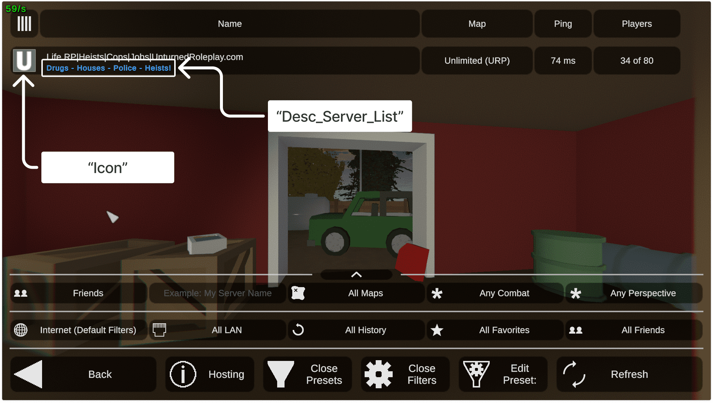
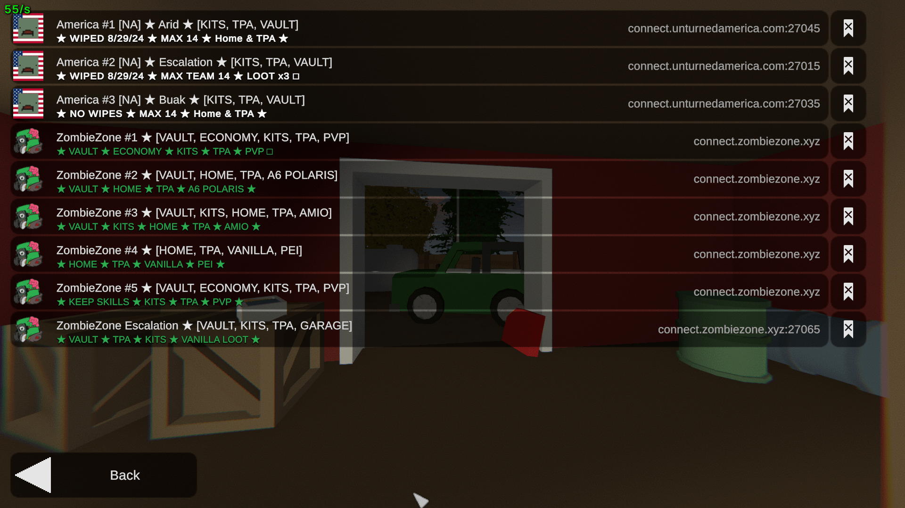

The `Browser` section in the `Config.json` file is used to configure the in-game browser settings for your Unturned server. This section allows you to customize the appearance including the icon, thumbnail, descriptions, monetization settings and more.

```json
"Browser": {
  "Icon": "",
  "Thumbnail": "",
  "Desc_Hint": "",
  "Desc_Full": "",
  "Desc_Server_List": "",
  "Login_Token": "",
  "BookmarkHost": "",
  "Monetization": "Unspecified",
  "Links": null
},
```



### Icon
The `Icon` field is used to specify the URL of the image that will be displayed in the server browser. This image should be at least 64x64 image file.
For example:
```
https://i.imgur.com/xz6ONp2.png
```

> **💡 PRO TIP**  
> You can use [Imgur](https://imgur.com/) to upload your images and get the direct link to use in the `Icon` and `Thumbnail` fields.  
> Remember that you must use URL which ends with image extension like `.png` or `.jpg`.

### Desc_Server_List
The server description visible in the server list. Can't be longer than 64 characters.  
For example:
```
<color=white><b>★ WIPED 8/29/24 ★ MAX GROUP 14 ★ LOOT x3 ★
```


### Thumbnail
The `Thumbnail` field is used to specify the URL of the image that will be displayed in the server info page. This image should be at least 256x256 image file. The URL can't be longer than 128 characters.  
For example:
```
https://i.imgur.com/xz6ONp2.png
```

### Desc_Hint
Text displayed under the server name in the server info page.  
For example:
```
<size=17><b><color=#B31942>MAKE <color=white>AMERICA</color> <color=#1066CF>UNTURNED</color> AGAIN!</b></size>
```

### Desc_Full
The full server description displayed under the map description in the server info page.
For example:
```
<color=white><size=15>Our server is a friendly community of players who enjoy playing Unturned together. We have active admins and a discord server for players to communicate and have fun. Join us today!</size></color>
```

### Links
The `Links` field is used to specify the URLs of the links that will be displayed in the server info page. This field should be an array of objects with the following structure:
```json
"Links": [
  {
    "Message": "<color=#B31942>Website</color>",
    "Url": "https://unturnedamerica.com"
  },
  {
    "Message": "<color=white>Discord Server</color>",
    "Url": "https://discord.gg/2SYxWQaSTQ"
  },
  {
    "Message": "<color=#1066CF>Store</color>",
    "Url": "https://unturnedamerica.com/store"
  }
]
```

### Login_Token
The `Login_Token` field is necessary to make your server visible to other players in the Internet server list. The token should be exactly 32 characters long.  
You can manually create GSLTs while logged in with your Steam account at [Steam Game Server Account Management](https://steamcommunity.com/dev/managegameservers)  
Other than making your server public, it provides the following benefits:
- Server code will remain the same and won't change between restarts.
- If you move your server to another IP, but keep the same GSLT, the players will still have it in their Favorites and History lists. This should happen within approximately 24 hours.

### Monetization
The `Monetization` field is used to specify the monetization settings for the server. This field should be one of the following values:
- `Unspecified` - use this if you don't know what to choose.
- `None` - it means that your server doesn't have any monetization or donation options.
- `NonGameplay` - your server has monetization options, but they don't affect gameplay. For example, color in chat or a special role in Discord.
- `Monetized` - your server has monetization options that affect gameplay. For example, kits, vaults, or special items.

### BookmarkHost
Configuring the Bookmark Host property along with a Login Token enables the bookmark button. When players bookmark your server they can then find it in the Bookmarks page in-game. 

It's nice to have, but not necessary. To learn how to set up the Bookmark Host, check out the [official documentation](https://docs.smartlydressedgames.com/en/stable/servers/bookmark-host.html).  



### Conclusion
This is all you need to know about the `Browser` section in the `Config.json` file. Here's an example of a complete `Browser` section in the `Config.json` file from my Unturned America server to help you understand how it all fits together:
```json
"Browser": {
  "Icon": "https://i.imgur.com/xz6ONp2.png",
  "Thumbnail": "https://i.imgur.com/xz6ONp2.png",
  "Desc_Hint": "<size=17><b><color=#B31942>MAKE <color=white>AMERICA</color> <color=#1066CF>UNTURNED</color> AGAIN!</b></size>",
  "Desc_Full": "<color=white><size=15>Our server is a friendly community of players who enjoy playing Unturned together. We have active admins and a discord server for players to communicate and have fun. Join us today!</size></color>",
  "Desc_Server_List": "<color=white><b>★ WIPED 8/29/24 ★ MAX GROUP 14 ★ LOOT x3 ★",
  "Login_Token": "XXXXXXXXXXXXXXXXXXXXXXXXXXXXXXX",
  "BookmarkHost": "connect.unturnedamerica.com",
  "Monetization": "Monetized",
  "Links": [
    {
        "Message": "<color=#B31942>Website</color>",
        "Url": "https://unturnedamerica.com"
    },
    {
        "Message": "<color=white>Discord Server</color>",
        "Url": "https://discord.gg/2SYxWQaSTQ"
    },
    {
        "Message": "<color=#1066CF>Store</color>",
        "Url": "https://unturnedamerica.com/store"
    }
  ]
}
```

### Video Tutorial
Check out our video tutorial on how to configure this section.

[video=7946e77b-f309-4261-9ae7-43f7bc38f43c]