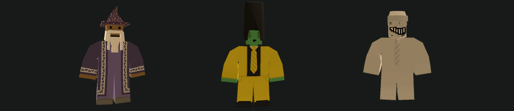

Gameplay settings can control the repair level, hitmarkers, crosshair, and other gameplay features.

Based on [Official Unturned Wiki](https://unturned.wiki.gg/wiki/Gameplay_config#Gameplay) and our experience.

```json
"Gameplay": {
  "Repair_Level_Max": 3,
  "Hitmarkers": true,
  "Crosshair": true,
  "Ballistics": false,
  "Chart": true,
  "Satellite": false,
  "Compass": false,
  "Group_Map": true,
  "Group_HUD": true,
  "Group_Player_List": true,
  "Allow_Static_Groups": true,
  "Allow_Dynamic_Groups": true,
  "Allow_Lobby_Groups": true,
  "Allow_Shoulder_Camera": true,
  "Can_Suicide": true,
  "Friendly_Fire": false,
  "Bypass_Buildable_Mobility": false,
  "Allow_Holidays": true,
  "Allow_Freeform_Buildables": true,
  "Allow_Freeform_Buildables_On_Vehicles": true,
  "Timer_Exit": 10,
  "Timer_Respawn": 10,
  "Timer_Home": 30,
  "Timer_Leave_Group": 30,
  "Max_Group_Members": 0,
  "Explosion_Launch_Speed_Multiplier": 1.0,
  "AirStrafing_Acceleration_Multiplier": 1.0,
  "AirStrafing_Deceleration_Multiplier": 1.0,
  "ThirdPerson_RecoilMultiplier": 2.0,
  "ThirdPerson_SpreadMultiplier": 2.0
}
```

### Repair_Level_Max
Controls the maximum Engineer skill level needed to repair items. If set to **0** repairing any item will be disabled regardless of the player's Engineer skill level.

### Hitmarkers
Enables or disables hitmarker visibility.

### Crosshair
Enables or disables crosshair visibility.

### Ballistics
Enables or disables projectile physics for ranged weapons. Setting this to **false** makes weapons use hitscan **(no bullet drop)** instead of ballistics.

### Chart
When enabled players will start with a Chart automatically without needing to locate one.

### Satellite
When enabled players will start with a GPS device automatically without needing to locate one.

### Compass
When enabled (**true**), players will start with a Compass in their inventory without needing to find one.

### Group_Map
Allows or disables group members being visible on the map.

### Group_HUD
Controls the visibility of group members names on the HUD.

### Group_Player_List
Controls whether groups are displayed in the player list.

### Allow_Static_Groups
Enables or disables predefined Steam-based static groups.

### Allow_Dynamic_Groups
Controls whether players can create and join dynamic (in game group) groups.

### Allow_Lobby_Groups
Enables or disables the use of lobby-based groups.

### Allow_Shoulder_Camera
Allows players to switch to an over-the-shoulder perspective in third-person mode.

### Can_Suicide
Controls whether players can use the suicide option.

### Friendly_Fire
Determines whether group members can damage each other.

### Bypass_Buildable_Mobility
Allows restricted buildables like Bedrolls and sentry turrets to be placed on vehicles.

### Allow_Holidays
Enables or disables seasonal or holiday events on the map.

### Allow_Freeform_Buildables
Determines whether freeform buildables can be crafted. In multiplayer, this is typically **false**, while in single-player, it is **true**.

### Allow_Freeform_Buildables_On_Vehicles
Determines whether freeform buildables can be placed on vehicles.

### Timer_Exit
Sets the delay in seconds before a player can exit the server or game.

### Timer_Respawn
Specifies the cooldown in seconds before a player can respawn after death. In single-player, this also applies to respawns at a claimed bed.

### Timer_Home
Sets the cooldown in seconds for respawning at a claimed bed. This setting applies only to multiplayer gameplay.

### Timer_Leave_Group
Specifies the wait time in seconds before a player is fully removed from a group.

### Max_Group_Members
Sets the maximum number of players that can join a group. A value of **0** means there is no limit.

### Explosion_Launch_Speed_Multiplier
Controls the speed at which explosions launch players. Values above **1.0** increase the launch speed.

### AirStrafing_Acceleration_Multiplier
Adjusts the acceleration speed for air-strafing. Values above **1.0** increase the acceleration.

### AirStrafing_Deceleration_Multiplier
Adjusts the deceleration speed for air-strafing. Values above **1.0** increase the deceleration.

### ThirdPerson_RecoilMultiplier
Sets the recoil intensity when firing in third-person view. Values above **1.0** increase recoil effects.

### ThirdPerson_SpreadMultiplier
Adjusts weapon spread in third-person mode. Values above **1.0** increase spread of fired shots.
