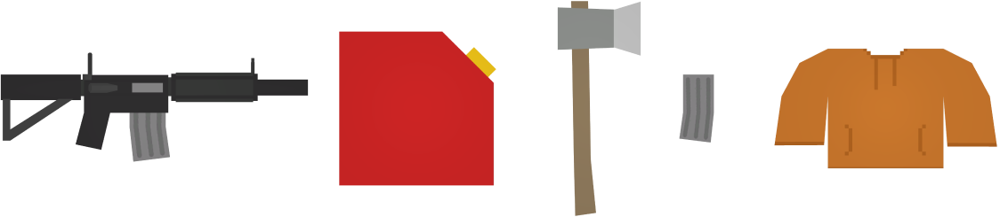
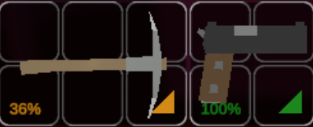

Items settings allow you to increase loot on the server, change the quality of items, and toggle durability for all or different item types.

```json
"Items": {
    "Spawn_Chance": 0.35,
    "Despawn_Dropped_Time": 600.0,
    "Despawn_Natural_Time": 900.0,
    "Respawn_Time": 50.0,
    "Quality_Full_Chance": 0.1,
    "Quality_Multiplier": 1.0,
    "Gun_Bullets_Full_Chance": 0.1,
    "Gun_Bullets_Multiplier": 1.0,
    "Magazine_Bullets_Full_Chance": 0.1,
    "Magazine_Bullets_Multiplier": 1.0,
    "Crate_Bullets_Full_Chance": 0.1,
    "Crate_Bullets_Multiplier": 1.0,
    "Has_Durability": false,
    "Food_Spawns_At_Full_Quality": true,
    "Water_Spawns_At_Full_Quality": true,
    "Clothing_Spawns_At_Full_Quality": true,
    "Weapons_Spawn_At_Full_Quality": true,
    "Default_Spawns_At_Full_Quality": true,
    "Clothing_Has_Durability": false,
    "Weapons_Have_Durability": false
}
```

### Spawn_Chance
Percent chance, represented as a decimal, for any given item spawn node to spawn an item. Value must be within a range of 0 to 1.

Number of item spawn nodes on official maps:
- PEI: 2,462
- Washington: 2,795
- Yukon: 1,207
- Russia: 6,409
- Germany: 4,347
- Monolith: 211

### Despawn_Dropped_Time
How many seconds it takes for an item dropped on the ground to disappear.  

For example items dropped by players when they die. It is set to 600 seconds by default, so it means players have 15 minutes to get back to their body and pick up their items.

### Despawn_Natural_Time
How many seconds it takes for an item that naturally spawned on the ground to disappear.  

For example items player didn't pick up when looting location, because they didn't find them interesting. They will naturally de-spawn and be replaced by new items.

### Respawn_Time
How many seconds it takes for an item spawn node to to be eligible to attempt to spawn a new item, after the original item has been picked up or de-spawned. 

### Quality_Full_Chance
Percent chance, represented as a decimal, for an item to spawn at full quality. Value must be within a range of 0 to 1.

If `Has_Durability` is set to false, then this setting doesn't have any effect.

For example if you set this to 0.6, then there's 60% chance for every item to spawn at full quality. Otherwise it will spawn at random quality, for example like this Pickaxe at 36% quality.



### Quality_Multiplier
Multiplier on the quality of items that spawn. When greater than "1", items will spawn at a higher quality. 

Basically it is a multiplier for the quality of items that spawn with below 100% quality. If this pickaxe was to spawn with 36% chance but quality multiplier was set to 2, then it would spawn at 72% quality.

### Gun_Bullets_Full_Chance
Percent chance, represented as a decimal, for gun bullets to spawn at full magazine. Value must be within a range of 0 to 1.

### Gun_Bullets_Multiplier
Multiplier on the amount of ammo in ranged weapons that spawn. When greater than "1", they will spawn with more ammo. 

For example if Maplestrike was randomized to spawn with 6 bullets, it will spawn with 12 bullets if this setting is set to 2.

### Magazine_Bullets_Full_Chance
Percent chance, represented as a decimal, for magazines to spawn at full capacity. Value must be within a range of 0 to 1.

### Magazine_Bullets_Multiplier
Multiplier on the amount of ammo in magazines that spawn. When greater than "1", they will spawn with more ammo.

### Crate_Bullets_Full_Chance
Percent chance, represented as a decimal, for ammunition crates to spawn at full capacity. Value must be within a range of 0 to 1.

### Crate_Bullets_Multiplier
Multiplier on the amount of ammo in ammunition crates that spawn. When greater than "1", they will spawn with more ammo.

### Has_Durability
Original option for disabling item quality. If false, items spawn at 100% quality and their quality doesn't decrease.  
If this is set to false, then all below settings are ignored.

### Food_Spawns_At_Full_Quality
Food-specific replacement for `Has_Durability`. If true, food spawns at 100% quality.

### Water_Spawns_At_Full_Quality
Water-specific replacement for `Has_Durability`. If true, water spawns at 100% quality.

### Clothing_Spawns_At_Full_Quality
Clothing-specific replacement for `Has_Durability`. If true, clothing spawns at 100% quality.

### Weapons_Spawn_At_Full_Quality
Weapon-specific replacement for `Has_Durability`. If true, weapons spawns at 100% quality.

### Default_Spawns_At_Full_Quality
Fallback used when spawning an item that doesn't fit into one of the other quality/durability settings. If true, items spawn at 100% quality.

### Clothing_Has_Durability
Clothing-specific replacement for `Has_Durability`. If false, clothing quality doesn't decrease when damaged.

### Weapons_Have_Durability
Melee and gun replacement for `Has_Durability`. Defaults to true. If false, weapons quality doesn't decrease when used.

### Video Tutorial
Check out our video tutorial on how to increase spawn chance of items and loot on your server.

[video=affd02b0-e416-4fbe-8363-86e4b2639813] 