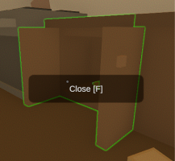
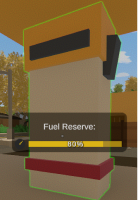
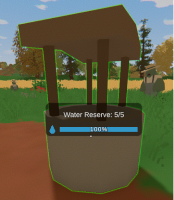
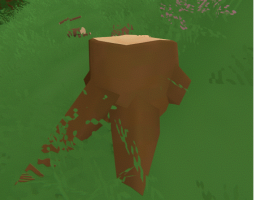
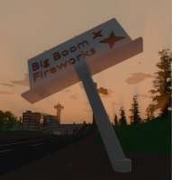
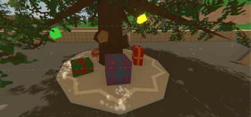
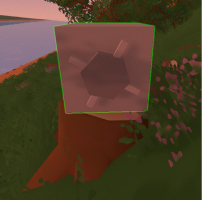

Objects settings can adjust the reset time and drop rates of objects, as well as toggle holiday drops like the Christmas tree with presents in the military base on Washington.

```json
"Objects": {
  "Binary_State_Reset_Multiplier": 1.0,
  "Fuel_Reset_Multiplier": 1.0,
  "Water_Reset_Multiplier": 1.0,
  "Resource_Reset_Multiplier": 1.0,
  "Resource_Drops_Multiplier": 1.0,
  "Rubble_Reset_Multiplier": 1.0,
  "Allow_Holiday_Drops": true,
  "Items_Obstruct_Tree_Respawns": true
}
```

### Binary_State_Reset_Multiplier
Multiplier on how long it takes for an object with a binary state `Interactability Binary_State` to reset. For example street lights, lamps, counters, fridge doors, etc.

So for example you noticed how counters and fridge doors close after a while (60 seconds), this is the setting that controls how long it takes for them to close automatically.

Let me show you by example how this multiplier affects the time it takes for a counter to close:
- **0.0** will disable the automatic closing of counters (and other objects with binary states)
- setting this value to **2.0** will make it take **120** seconds (2 minutes) for them to close automatically
- setting this value to **0.5** will make it take **30** seconds for them to close automatically



### Fuel_Reset_Multiplier
Multiplier on how long it takes for fuel objects to reset. For example gas pumps at gas stations.

Default for gas pumps is **1500** seconds (25 minutes). This setting will adjust how long it takes to restore to 100% fuel after being used.



### Water_Reset_Multiplier
Multiplier on how long it takes for water objects to reset. For example water wells.



### Resource_Reset_Multiplier
Multiplier on how long it takes for resource objects to reset. For example trees, rocks with metal scrap, and bushes with blueberries etc.

Default reset time for maple tree is **600** seconds (10 minutes). This setting will adjust how long it takes for the tree to respawn.



### Resource_Drops_Multiplier
Multiplier on how many resources are dropped from resource objects.

For example maple tree drops **6-9** logs and sticks by default. If you set the multiplier to **2**, it will drop **12-18** logs and sticks.

### Rubble_Reset_Multiplier
Rubble are all the objects that can be destroyed like computers, billboards etc.

Billboards by default have a reset time of **300** seconds (5 minutes) and smaller objects like computers and coffee machines usually **60** seconds (1 minute).

Setting this to **2** will make it take 10 minutes for billboards to respawn and **2** minutes for computers and coffee machines for example.



### Allow_Holiday_Drops
If set to true, holiday drops will be enabled.

You know like when there's Christmas the tree with presents spawns in the military base on Washington for example. If you set this to false,
the tree with presents will not spawn :(




### Items_Obstruct_Tree_Respawns
If set to true, items will obstruct the respawn of resource objects. For example, if a tree is obstructed by a player-placed barricade like locker, it will not respawn until the locker is removed.

Remember when players used to hide lockers in trees. I did that too :D



### Video Tutorial
Learn about all those settings in our video tutorial.

[video=5007d98a-4e0a-4270-98e8-f44aa0d94d18]