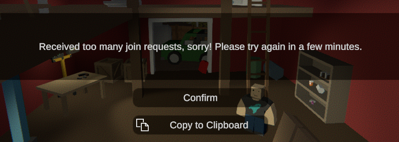
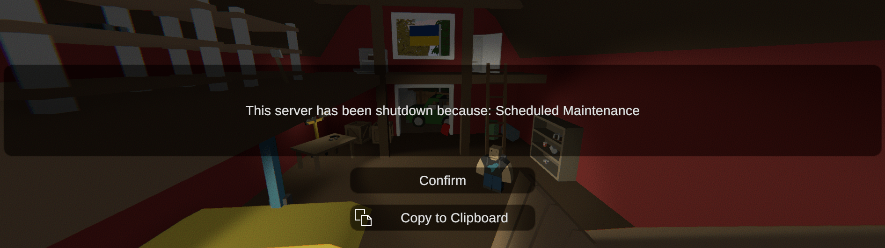
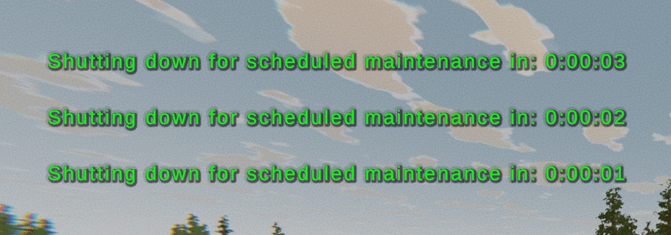

Server section allows you to customize server settings like VAC and BattlEye security, ping limits, timeouts, rate limits, fake lag, scheduled shutdowns, and more. This section is used to configure the server's behavior and security settings.

Based on [Official Unturned Wiki](https://unturned.wiki.gg/wiki/Gameplay_config#Server) and our experience.

```json
"Server": {
  "VAC_Secure": true,
  "BattlEye_Secure": true,
  "Max_Ping_Milliseconds": 750,
  "Timeout_Queue_Seconds": 15.0,
  "Timeout_Game_Seconds": 30.0,
  "Max_Packets_Per_Second": 50.0,
  "Join_Rate_Limit_Window_Seconds": 40.0,
  "Rate_Limit_Kick_Threshold": 10,
  "Fake_Lag_Threshold_Seconds": 3.0,
  "Fake_Lag_Log_Warnings": false,
  "Fake_Lag_Damage_Penalty_Multiplier": 0.1,
  "Enable_Kick_Input_Spam": false,
  "Enable_Kick_Input_Timeout": false,
  "Enable_Scheduled_Shutdown": false,
  "Scheduled_Shutdown_Time": "1:30 am",
  "Scheduled_Shutdown_Warnings": [
      "00:30:00",
      "00:15:00",
      "00:05:00",
      "00:01:00",
      "00:00:30",
      "00:00:15",
      "00:00:03",
      "00:00:02",
      "00:00:01"
  ],
  "Enable_Update_Shutdown": false,
  "Update_Steam_Beta_Name": "public",
  "Update_Shutdown_Warnings": [
      "00:03:00",
      "00:01:00",
      "00:00:30",
      "00:00:15",
      "00:00:03",
      "00:00:02",
      "00:00:01"
  ],
  "Validate_EconInfo_Hash": true,
  "Use_FakeIP": false
}
```

### VAC_Secure
If VAC Secure is enabled, the server will require VAC to be enabled on the client to join. This setting is recommended to prevent cheating.

### BattlEye_Secure
BattleEye is an anti-cheat software as well as VAC. If BattlEye Secure is enabled, the server will require BattlEye to be enabled on the client to join. This setting is also recommended to prevent cheating.

### Max_Ping_Milliseconds
The maximum ping allowed players can have while playing on the server. If a player's ping exceeds this limit, they will be kicked from the server. The following message will be displayed in the server console:
```
Kicking because ping (922) exceeds limit (750): PlayerID: 76561198285897058 Name: MCrow Character: MCrow
```
### Timeout_Queue_Seconds
The timeout in seconds the server will hold a spot in the queue for player who lost connection, before kicking them from the queue. This can happen only to players who have unstable internet connection. I recommend keeping those values default.

### Timeout_Game_Seconds
Same as `Timeout_Queue_Seconds`, but for players who are already in the game. If a player loses connection to the server, they will have this amount of time to reconnect before being kicked from the server.

### Max_Packets_Per_Second
The maximum number of packets one player can send to the server per second. The packets can be for example chat messages, player movement, etc. I don't recommend changing this value.

### Join_Rate_Limit_Window_Seconds
The join_Rate_Limit_Window_Seconds sets a time period during which the server counts how many times an IP address tries to connect. If an address connects too many times within this period, it gets blocked, but once the time is up, the count resets.

If ready-to-connect messages are received more than twice from the same client in less than this many seconds they will be kicked.



### Rate_Limit_Kick_Threshold
If a rate-limited method is called this many times within cooldown window the client will be kicked.
For example a value of 1 means the client will be kicked the first time they call the method off-cooldown. (not recommended)

The "Drop Item" method is rate-limited to 10 times per second. If a player tries to drop more than 10 items per second, they will be kicked from the server more times than the value of `Rate_Limit_Kick_Threshold`, they will be kicked from the server. This is impossible for normal player to do, but it can be used to prevent some exploits. 

### Fake_Lag_Threshold_Seconds
Ordinarily the server should be receiving multiple input packets per second from a client. If more than this amount of time passes between input packets we flag the client as potentially using a lag switch, and modify their stats (e.g. reduce player damage) for a corresponding duration. Minimum value is 1.

This setting is used to detect and kick potential cheaters. I recommend sticking with the default value for this type of settings.

### Fake_Lag_Log_Warnings
Whether fake lag detection should log to command output. False positives are relatively likely when client framerate hitches (e.g. loading dense region), so this is best used for tuning threshold rather than bans.

### Fake_Lag_Damage_Penalty_Multiplier
PvP damage multiplier while under fake lag penalty.

### Enable_Kick_Input_Spam
Should we kick players after detecting spammed calls to askInput?
If enabled, it will kick players who are spamming the server with requests for input. This is to prevent cheaters from exploiting the server.

### Enable_Kick_Input_Timeout
Should we kick players if they do not submit inputs for a long time?
If enabled, it will kick players who are not submitting inputs for a long time.

### Enable_Scheduled_Shutdown
If set to true, the server will shutdown at the time specified in the next field.



### Scheduled_Shutdown_Time
When the server should shutdown if `Enable_Scheduled_Shutdown` is set to true. The time should be in the format `HH:mm am/pm`. Remember that it's in the server's timezone, so if your server is hosted in California, the timezone is probably PST (-8h UTC) or PDT (-7 UTC).

```json
"Scheduled_Shutdown_Time": "1:30 pm",
```

### Scheduled_Shutdown_Warnings
The server will display warnings to players before the server shuts down at the specified time. The warnings look like this in-game:



Here's an example of the `Scheduled_Shutdown_Warnings` field that sends a warning message every 1 second for 10 seconds before the server shuts down:
```json
"Update_Shutdown_Warnings": [
  "00:00:10",
  "00:00:09",
  "00:00:08",
  "00:00:07",
  "00:00:06",
  "00:00:05",
  "00:00:04",
  "00:00:03",
  "00:00:02",
  "00:00:01"
],
```

You can modify the message of the warnings and kick explanation in the `/Localization/English/Server/ServerConsole.dat` file.
```
ScheduledMaintenance_KickExplanation Scheduled Maintenance
ScheduledMaintenance_Timer Shutting down for scheduled maintenance in: {0}
```

### Enable_Update_Shutdown
If set to true, the server will shutdown when an Unturned update is available. I highly recommend enabling this option to keep your server up to date automatically. 

### Update_Steam_Beta_Name
You only need to change this value if you are using a beta branch of Unturned. Then to enable auto updates set the value to `preview` instead of `public`.

It works by checking the Unturned version from this API:
* public - [smartlydressedgames.com/unturned-steam-versions/public.txt](https://smartlydressedgames.com/unturned-steam-versions/public.txt) 
* preview - [smartlydressedgames.com/unturned-steam-versions/preview.txt](https://smartlydressedgames.com/unturned-steam-versions/preview.txt)

### Update_Shutdown_Warnings
The server will display warnings to players before the server shuts down for an update. It works the same way as `Scheduled_Shutdown_Warnings`.

You can optionally modify the message in the `/Localization/English/Server/ServerConsole.dat` file as well.
```
UpdateShutdown_KickExplanation Updating game to newer version {0}
RollbackShutdown_KickExplanation Rolling back game to older version {0}
UpdateShutdown_Timer Shutting down for update to newer version {0} in: {1}
RollbackShutdown_Timer Shutting down for rollback to older version {0} in: {1}
```

### Validate_EconInfo_Hash
Whether or not the Econ hash is validated with the server. This prevents clients from locally exploiting other players' visibility. Set to "false" to disable this setting. 

### Use_FakeIP
Using a Steam Fake IP allows players to join your server by IP address without port forwarding. It also protects your server from DDoS attacks, because the traffic is routed through Steam servers. Another great advantage of using Fake IP is that it won't reveal your server's real IP address. 

To learn more about Fake IP, check out the [official documentation](https://docs.smartlydressedgames.com/en/stable/servers/fake-ip.html).

### Video Tutorial
If you prefer video format, here is a video tutorial on how to configure the server settings in the `Config.json` file:

[video=0e2dec24-4bb9-4886-af77-1e01faf5e4a6]