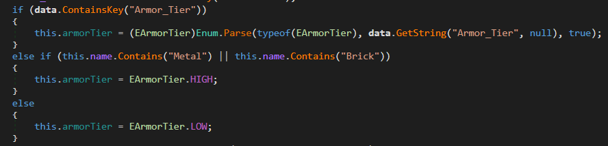

Structures settings can adjust the decay time and armor of structures, as well as the damage and repair multipliers for guns and melee weapons.

```json
"Structures": {
  "Decay_Time": 604800,
  "Armor_Lowtier_Multiplier": 1.0,
  "Armor_Hightier_Multiplier": 0.5,
  "Gun_Lowcal_Damage_Multiplier": 1.0,
  "Gun_Highcal_Damage_Multiplier": 1.0,
  "Melee_Damage_Multiplier": 1.0,
  "Melee_Repair_Multiplier": 1.0
}
```

### Decay_Time
The time in seconds it takes for a structure to decay. The default is **604800** seconds (1 week).

Works the same way as `Decay_Time` of barricades.

If owner of the structure didn't join the server for a `Decay_Time`, the structure will not be loaded on the next server restart. When server is loading structures it checks if the owner was online in the last `Decay_Time`. If not, the structure is not loaded and removed.

### Armor_Lowtier_Multiplier
Damage multiplier for low-tier structures such as those made from wood like maple floor, pine wall, birch pillar, etc.

The lower the multiplier, the less damage the structure will take. For example, if the multiplier is set to **0.5**, the structure will take half the damage it would normally take.

> **💡 PRO TIP**
> The equation of how multipliers work is:
> ```damage = damage * multiplier```

### Armor_Hightier_Multiplier
Damage multiplier for high-tier structures. If structure contains "Metal" or "Brick" in its name, it is considered high-tier.



### Gun_Lowcal_Damage_Multiplier
Damage multiplier for low-caliber guns. Low-caliber guns are for example: Eaglefire, Cobra, Schofield, etc.

```damage = damage * Gun_Lowcal_Damage_Multiplier```

### Gun_Highcal_Damage_Multiplier
Damage multiplier for high-caliber guns. High-caliber guns are for example: Timberwolf, Grizzly, Dragonfang, etc.

For example setting this to **0.75** will cause Dragonfang to deal `0.75 * 30 = 22.5` damage to structures.

### Melee_Damage_Multiplier
Damage multiplier for melee weapons. Melee weapons are for example: Knife, Katana, Sledgehammer, etc.

```damage = damage * Melee_Damage_Multiplier```

### Melee_Repair_Multiplier
Repair multiplier for melee weapons. The lower the multiplier, the less repair the weapon will deal to structures. For example, if the multiplier is set to **0.5**, the weapon will receive half the repair it would normally deal to structures.

```repair = repair * Melee_Repair_Multiplier```

### Video Tutorial
Learn how to wipe structures, barricades and players data on your server with this video tutorial.

[video=46e9cb7d-f2af-4a82-99af-3fead59527bc]