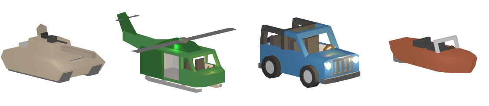
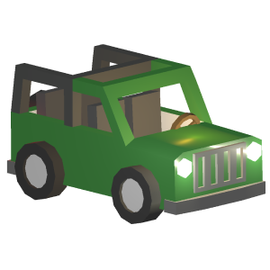
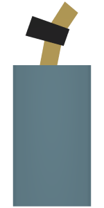

Vehicles settings control their decay time, respawn time, and the number of vehicles that can spawn on the server.
[Official Unturned Wiki](https://unturned.wiki.gg/wiki/Gameplay_config#Vehicles)

```json
"Vehicles": {
  "Decay_Time": 604800.0,
  "Decay_Damage_Per_Second": 0.1,
  "Has_Battery_Chance": 1.0,
  "Min_Battery_Charge": 0.8,
  "Max_Battery_Charge": 1.0,
  "Has_Tire_Chance": 1.0,
  "Respawn_Time": 300.0,
  "Unlocked_After_Seconds_In_Safezone": 3600.0,
  "Armor_Multiplier": 1.0,
  "Child_Explosion_Armor_Multiplier": 1.0,
  "Gun_Lowcal_Damage_Multiplier": 1.0,
  "Gun_Highcal_Damage_Multiplier": 1.0,
  "Melee_Damage_Multiplier": 1.0,
  "Melee_Repair_Multiplier": 1.0,
  "Max_Instances_Tiny": 4,
  "Max_Instances_Small": 8,
  "Max_Instances_Medium": 16,
  "Max_Instances_Large": 32,
  "Max_Instances_Insane": 64
}
```

### Decay_Time
The time in seconds it takes for a vehicle to decay. The default is **604800** seconds (1 week).

If a vehicle has not been driven after this many seconds, it will start to be damaged over time. The damage is calculated by the `Decay_Damage_Per_Second` setting.

### Decay_Damage_Per_Second
The amount of damage a vehicle takes per second when it is decaying. The default is **0.1**.



So for example if vehicle is **Offroader** with **600** HP, it will lose **0.1** HP every second. Meaning it will take **6000** seconds = **1 hour and 40 minutes** to destroy the vehicle.

Remember that the vehicle will only start to decay after the `Decay_Time` has passed. Which is pretty rare for a vehicle to be left untouched for a week.

### Has_Battery_Chance
The chance that a vehicle will spawn naturally with a battery. The default is **1.0** (100%).


### Min_Battery_Charge
The minimum charge a battery can have when a vehicle spawns naturally. The default is **0.8** (80%).

### Max_Battery_Charge
The maximum charge a battery can have when a vehicle spawns naturally. The default is **1.0** (100%).

### Has_Tire_Chance

The chance that a vehicle will spawn naturally with all tires. The default is **1.0** (100%).

For example if vehicle has **4** tire slots and `Has_Tire_Chance` is **0.5**, then for each slot there is a **50%** chance that it will spawn with a tire. Meaning the vehicle might spawn with **0-4** tires.

### Respawn_Time
How many seconds it takes for a vehicle spawn node to attempt to spawn a new vehicle, after the original has been moved or destroyed. The default is **300** seconds (5 minutes).

The vehicles will only re-spawn if the server has less than the maximum number of vehicles spawned, which is controlled by the `Max_Instances` settings.

### Unlocked_After_Seconds_In_Safezone
How many seconds a vehicle can be in a safezone before it becomes unlocked. The default is **3600** seconds (1 hour).

It is used to prevent players for keeping their vehicles locked in safezone for too long where they can't be destroyed.

### Armor_Multiplier
The multiplier for the armor of the vehicle. The default is **1.0**.

The lower the value, the less damage the vehicle will take from bullets and explosions.

For example if a vehicle has **1000** HP and `Armor_Multiplier` is **0.5**, then it will have **2000** HP.

### Child_Explosion_Armor_Multiplier
When an explosion is obstructed by buildables, like landmines, attached to the vehicle, the damage dealt against the vehicle is multiplied by this value. When less than **1**, less damage is dealt. 

### Gun_Lowcal_Damage_Multiplier
The multiplier for the damage dealt by low caliber guns like Maplestrike, Hawkhound, Ace etc. The default is **1.0**.

If you want these guns to deal less damage to vehicles, you can lower this value.

### Gun_Highcal_Damage_Multiplier
The multiplier for the damage dealt by high caliber guns like Timberwolf, Grizzly, Dragonfang etc. The default is **1.0**.

If you want these guns to deal less damage to vehicles, you can lower this value.

### Melee_Damage_Multiplier
The multiplier for the damage dealt by melee weapons like Pocketknife, Sledgehammer, Military Knife etc. The default is **1.0**.

If you want these weapons to deal less damage to vehicles, you can lower this value.

### Melee_Repair_Multiplier

The multiplier for the repair amount dealt by Blowtorch and its equivalents from mods. The default is **1.0**.

If you want blowtorch to repair vehicles faster, you can increase this value or decrease it if you want it to repair slower.

### Max_Instances
The maximum number of vehicles that can exist at the same time on a map of specific size.

- **Tiny** - no official maps
- **Small** - Alpha Valley, Monolith
- **Medium** - PEI, Washington, Yukon
- **Large** - Russia, Germany
- **Insane** - no official maps

For example, if you're server is using **Washington** map and `Max_Instances_Medium` is set to **16** then the maximum number of vehicles naturally spawning will be just **16**.

I recommend increasing this value. However the number of vehicles that will spawn naturally is also limited by the number of spawn-points on every map.

Number of vehicle spawn-points on official survival maps:
- **PEI** - 95
- **Washington** - 103
- **Yukon** - 44
- **Russia** - 169
- **Germany** - 90

### Video Tutorials
The video tutorial about Vehicles section in Config.json file.

[video=49da7869-07bf-4640-8d3b-a9ad7af056b8]

Check out our video tutorial on how to increase loot and number of vehicles on your server.

[video=affd02b0-e416-4fbe-8363-86e4b2639813] 