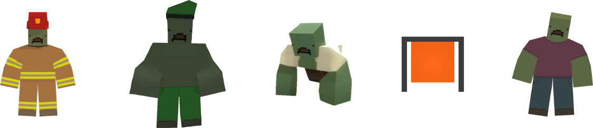

Zombies settings allow you to configure the behavior of zombies on your server. You can change the spawn chance, loot chance, and other settings to make the game more challenging or easier.

```json
"Zombies": {
  "Spawn_Chance": 0.2,
  "Loot_Chance": 0.55,
  "Crawler_Chance": 0.0,
  "Sprinter_Chance": 0.0,
  "Flanker_Chance": 0.0,
  "Burner_Chance": 0.0,
  "Acid_Chance": 0.0,
  "Boss_Electric_Chance": 0.0,
  "Boss_Wind_Chance": 0.0,
  "Boss_Fire_Chance": 0.0,
  "Spirit_Chance": 0.0,
  "DL_Red_Volatile_Chance": 0.0,
  "DL_Blue_Volatile_Chance": 0.0,
  "Boss_Elver_Stomper_Chance": 0.0,
  "Boss_Kuwait_Chance": 0.0,
  "Respawn_Day_Time": 360.0,
  "Respawn_Night_Time": 30.0,
  "Respawn_Beacon_Time": 0.0,
  "Quest_Boss_Respawn_Interval": 600.0,
  "Damage_Multiplier": 0.75,
  "Armor_Multiplier": 1.25,
  "Backstab_Multiplier": 1.25,
  "NonHeadshot_Armor_Multiplier": 1.0,
  "Beacon_Experience_Multiplier": 1.0,
  "Full_Moon_Experience_Multiplier": 2.0,
  "Min_Drops": 1,
  "Max_Drops": 1,
  "Min_Mega_Drops": 5,
  "Max_Mega_Drops": 5,
  "Min_Boss_Drops": 8,
  "Max_Boss_Drops": 10,
  "Slow_Movement": true,
  "Can_Stun": true,
  "Only_Critical_Stuns": false,
  "Weapons_Use_Player_Damage": false,
  "Can_Target_Barricades": true,
  "Can_Target_Structures": true,
  "Can_Target_Vehicles": true,
  "Beacon_Max_Rewards": 0,
  "Beacon_Max_Participants": 0,
  "Beacon_Rewards_Multiplier": 1.0
}
```

### Spawn_Chance
Percent chance (represented as a decimal) for any given zombie spawn node to spawn a zombie. Value must be within a range of **0.0** to **1.0**.

For example **0.2** means **20%** chance to spawn a zombie. Setting this value to **0.0** will prevent zombies from spawning.

Zombie spawn nodes on official maps:
- **PEI** - 1451
- **Washington** - 1137
- **Yukon** - 524
- **Russia** - 2458
- **Germany** - 1955

### Loot_Chance
Percent chance (represented as a decimal) for any given zombie to drop loot. Value must be within a range of **0.0** to **1.0**.

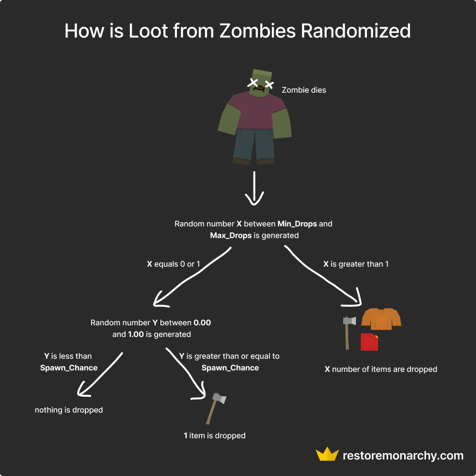

### Crawler_Chance
The chance for a zombie to spawn as a crawler. Value should be within a range of **0.0** to **0.5**.

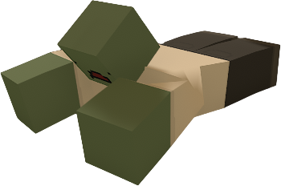

### Sprinter_Chance
The chance for a zombie to spawn as a sprinter. Value should be within a range of **0.0** to **0.5**.

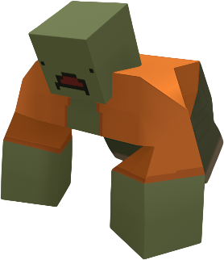

### Flanker_Chance
The chance for a zombie to spawn as a flanker. Value should be within a range of **0.0** to **0.5**.

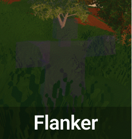

### Burner_Chance
The chance for a zombie to spawn as a burner. Value should be within a range of **0.0** to **0.5**.

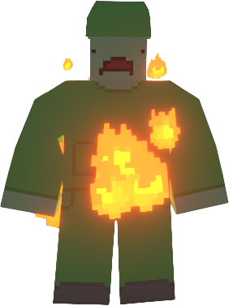

### Acid_Chance
The chance for a zombie to spawn as an acid zombie. Value should be within a range of **0.0** to **0.5**.

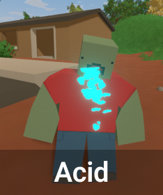

### Boss_Electric_Chance
The chance for a zombie to spawn as an electric boss. Value should be within a range of **0.0** to **0.5**.

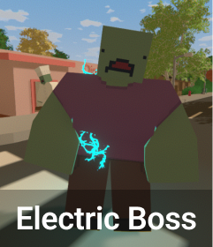

### Boss_Wind_Chance
The chance for a zombie to spawn as a wind boss. Value should be within a range of **0.0** to **0.5**.

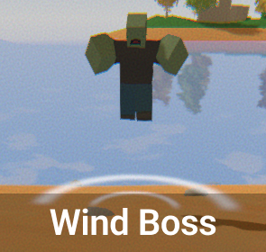

### Boss_Fire_Chance
The chance for a zombie to spawn as a fire boss. Value should be within a range of **0.0** to **0.5**.

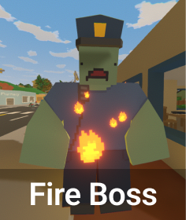

### Spirit_Chance
The chance for a zombie to spawn as a spirit. Value should be within a range of **0.0** to **0.5**.

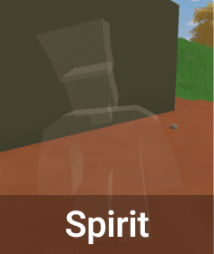

### DL_Red_Volatile_Chance
The chance for a zombie to spawn as a red volatile. Value should be within a range of **0.0** to **0.5**.

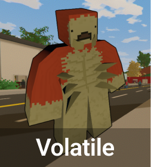

> **💡 PRO TIP**  
> Volatile zombies can only spawn at night.

### DL_Blue_Volatile_Chance
The chance for a zombie to spawn as a blue volatile. Value should be within a range of **0.0** to **0.5**.

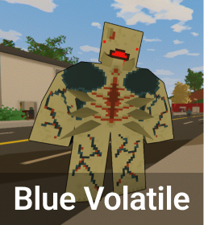

### Boss_Elver_Stomper_Chance
The chance for a zombie to spawn as an Elver stomper boss. Value should be within a range of **0.0** to **0.5**.

### Boss_Kuwait_Chance
The chance for a zombie to spawn as a Kuwait boss. Value should be within a range of **0.0** to **0.5**.

### Respawn_Day_Time
The time in seconds it takes for a zombie to respawn during the day.

### Respawn_Night_Time
The time in seconds it takes for a zombie to respawn during the night.

### Respawn_Beacon_Time
The time in seconds it takes for a zombie to respawn during a horde beacon.

### Quest_Boss_Respawn_Interval
How many seconds it takes for a boss zombie spawned from a quest to attempt to spawn a new boss zombie. This setting is useful to prevent players from easily farming boss-tier loot. 

For example Kaiser Zombie Boss zombie from the quest on Germany map.

### Damage_Multiplier
Multiplier for the damage dealt by zombies. **0.75** means **75%** of the default damage.

The default damage of normal zombies on official maps is **15**, so with **0.75** multiplier the damage they deal is **11**.

### Armor_Multiplier
Multiplier for the armor of zombies when they are hit in the head. 

If you want to modify the armor of zombies when they are hit in other parts of the body, you can use the **NonHeadshot_Armor_Multiplier** setting.

The lower the value the less damage zombies take. 

For example setting this value to **0.5** will make zombies take **50%** less damage, so it's like they would have **200** HP instead of **100**, which is the default value on official maps.

### Backstab_Multiplier
Multiplier for the damage dealt by backstabbing zombies. Backstabbing is hitting a zombie in the back.

### NonHeadshot_Armor_Multiplier
Multiplier for the armor of zombies when they are not hit in the head.

### Beacon_Experience_Multiplier
Multiplier for the experience gained from killing zombies during a horde beacon.

### Full_Moon_Experience_Multiplier
Multiplier for the experience gained from killing zombies during a full moon night.

### Min_Drops
Minimum number of items dropped by a normal, crawler, sprinter, flanker, burner, acid, and spirit zombies.

### Max_Drops
Maximum number of items dropped by a normal, crawler, sprinter, flanker, burner, acid, and spirit zombies.

### Min_Mega_Drops
Minimum number of items dropped by a mega zombie.

### Max_Mega_Drops
Maximum number of items dropped by a mega zombie.

### Min_Boss_Drops
Minimum number of items dropped by a boss zombie.

### Max_Boss_Drops
Maximum number of items dropped by a boss zombie.

### Work in progress
We are still working on this page. If you have any suggestions or would like to contribute, please let us know!

### Video Tutorial
Check out our video tutorial on how to increase number of items dropped by zombies and loot on your server.

[video=affd02b0-e416-4fbe-8363-86e4b2639813] 