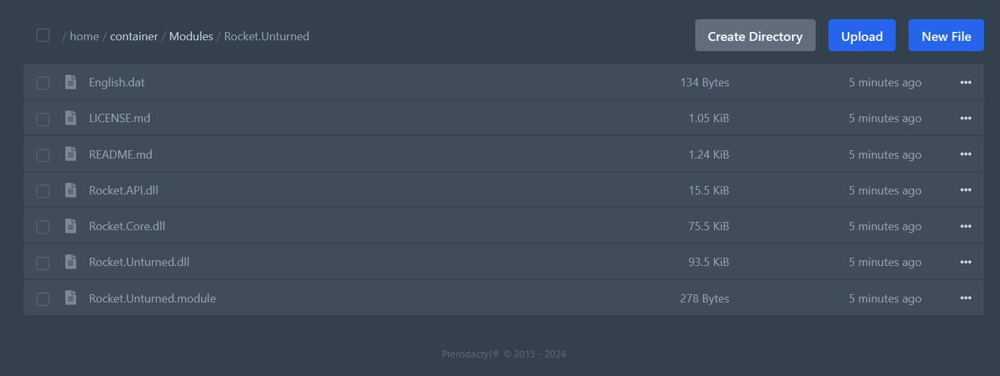

Rocket usually comes pre-installed on most Unturned server hosting platforms, but if you are running your server on your own machine, you will need to install Rocket manually.

> **💡 PRO TIP**  
> You can check if Rocket is already installed on your server by looking for the **Rocket.Unturned** folder in **Modules** directory. If it's there, you are good to go.
>
> 

### Installing Rocket
1. Copy the `Rocket.Unturned` folder from the `Extras` directory.
2. Paste it into the game's `Modules` directory.
3. Restart your server.

### Verifying Installation
To verify that Rocket is installed correctly, once the server is running, you can use `rocket` command in the server console. 

```
> rocket
Rocket v4.9.3.17 for Unturned v3.24.5.1
https://rocketmod.net - 2017
```

If Rocket is installed correctly, you will see the version of Rocket and Unturned that you are running.

### Updating Rocket
To update Rocket, simply repeat the installation process. The new releases of Rocket are included in the `Extras` directory of the game files.

### Video Tutorial
Learn how to install Rocket on your Unturned server on Windows in our video tutorial.

[video=e5ef75cc-caac-42ae-8f5a-c0e254c4fe99]


