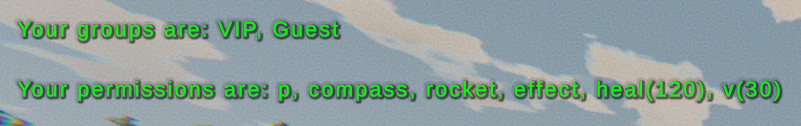
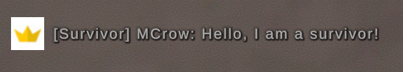

Rocket permissions system allows you to define groups which are also known as ranks or roles. Each group can have a set of permissions to execute certain commands or actions.  

You will find `Permissions.config.xml` file in the `Rocket` directory of your server.

Having done changes to the permissions file, you need to restart the server or use the `/p reload` command to apply the changes.

```xml
<?xml version="1.0" encoding="utf-8"?>
<RocketPermissions xmlns:xsd="http://www.w3.org/2001/XMLSchema" xmlns:xsi="http://www.w3.org/2001/XMLSchema-instance">
  <DefaultGroup>default</DefaultGroup>
  <Groups>
    <Group>
      <Id>default</Id>
      <DisplayName>Guest</DisplayName>
      <Prefix />
      <Suffix />
      <Color>white</Color>
      <Members />
      <Priority>100</Priority>
      <Permissions>
        <Permission Cooldown="0">p</Permission>
        <Permission Cooldown="0">compass</Permission>
        <Permission Cooldown="0">rocket</Permission>
      </Permissions>
    </Group>
    <Group>
      <Id>vip</Id>
      <DisplayName>VIP</DisplayName>
      <Prefix />
      <Suffix />
      <Color>FF9900</Color>
      <Members>
        <Member>76561198016438091</Member>
      </Members>
      <ParentGroup>default</ParentGroup>
      <Priority>100</Priority>
      <Permissions>
        <Permission Cooldown="0">effect</Permission>
        <Permission Cooldown="120">heal</Permission>
        <Permission Cooldown="30">v</Permission>
      </Permissions>
    </Group>
  </Groups>
</RocketPermissions>
```

### DefaultGroup
The `<DefaultGroup>` specifies which of the groups should be used as default that is assigned to every player who joins the server.  
The value must be the `<Id>` value of the group.

### Groups
The `<Groups>` element consists of multiple `<Group>` items.  
When adding a new group, it needs to be placed inside the `<Groups>` element.

### Group
Each `<Group>` element represents a single group with its settings and permissions.

### Id
The `<Id>` element is the unique identifier of the group. It is used to reference the group in other parts of the configuration and when assigning a group to a player using a command, for example: `/p add MCrow vip`.

### DisplayName
As the name suggests, `<DisplayName>` value is a public name of the group shown to players for example when they use `/p` command to view their groups and permissions.



### Prefix
The `<Prefix>` element is used to append a text before the player's name.

```xml
<Prefix>[Survivor] </Prefix>
```



> **💡 PRO TIP**  
> Notice the space after the prefix text. It is important to add a space after the prefix text to separate it from the player's name. Same goes for the suffix text.

### Suffix
The `<Suffix>` element is used to append a text after the player's name.

```xml
<Suffix> [VIP]</Suffix>
```


> **💡 PRO TIP**  
> If you give rank with prefix or suffix to a player while they are already on the server, they will have to reconnect to apply the changes.

### Color
This is a color of player messages in chat. It can be a color name or a hexadecimal color code.

```xml
<Color>FF9900</Color>
```

The color names you can use are the following: `black`, `blue`, `clear`, `cyan`, `gray`, `green`, `grey`, `magenta`, `red`, `white`, `yellow`, `rocket`.

### Members
The `<Members>` element contains a list of Steam IDs of players who are members of the group.

```xml
<Members>
  <Member>76561198016438091</Member>
</Members>
```

> **💡 PRO TIP**  
> The Steam ID in a default Permissions.config.xml is a Steam ID of Rocket creator, [fr34kyn01535](https://steamcommunity.com/profiles/76561198016438091). You can remove it, replace it with your own Steam ID or just keep it there :)

### ParentGroup
Use <ParentGroup> if you want to inherit permissions from another group. 

It is useful when you have multiple ranks that are upgradeable like on Unbeaten. Their MVP rank has its own vault but also includes a vault from previous rank VIP. 

```xml
<ParentGroup>VIP</ParentGroup>
```

### Priority
The lower the priority value the more important is the rank. If you have Moderator and VIP rank, you want to set Moderator to have a lower priority than VIP. 

If the priorities are the same, the rank that is located higher in the Permissions.config.xml file will have more power.

```xml
<Priority>50</Priority>
```

### Permissions
The `<Permissions>` element contains a list of `<Permission>` elements. Each `<Permission>` element represents a permission that the group has.

They are usually permissions to execute certain commands, but not only.
For example [RP Licenses](https://restoremonarchy.com/plugins/rplicenses) plugin has **license.vehicle** permission to drive a vehicle. If you wanted a player to be able to drive a vehicle, you would add this permission to their group.

The `<Permission>` tags also have **Cooldown** attribute if you want to limit the interval in which the member of the given group can execute some command. It is specified in seconds. A good example is **heal** with a cooldown of **120** seconds in the VIP group.

```xml
<Permissions>
  <Permission Cooldown="0">effect</Permission>
  <Permission Cooldown="120">heal</Permission>
  <Permission Cooldown="30">v</Permission>
</Permissions>
```

### Video Tutorial
Learn how to add ranks and permissions to your Unturned server with Rocket

[video=30a4e3e7-7fb2-47e2-a225-2927f1e584c8]