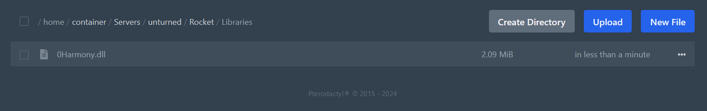
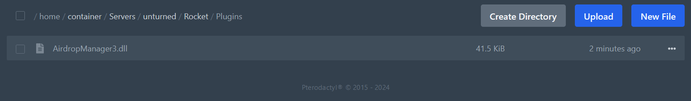
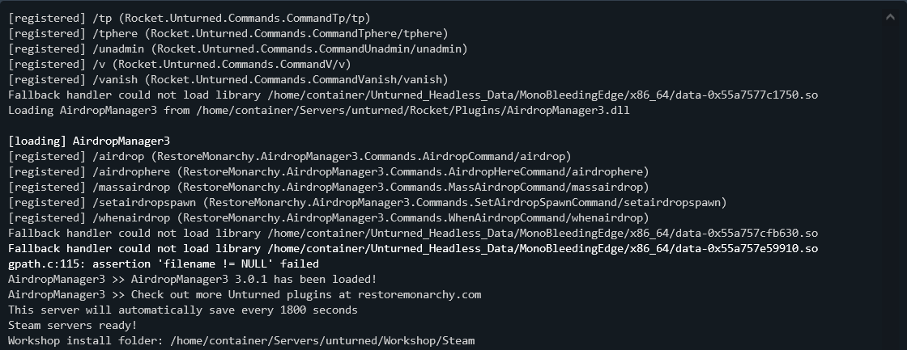
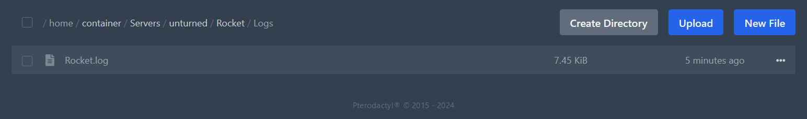

### Download Plugins
Here's list of some popular websites where you can find free and paid plugins for your Unturned server:
- [restoremonarchy.com](https://restoremonarchy.com/plugins)
- [uedit.co](https://uedit.co/RocketMod/Plugins/)
- [unturnedstore.com](https://unturnedstore.com/)
- [imperialplugins.com](https://imperialplugins.com/)

> **💡 PRO TIP**  
> We only guarantee the quality and safety of plugins downloaded from our website **restoremonarchy.com**.

### Install Plugins (ZIP File)
Once you download the plugins you want to install, follow these steps to install them on your Unturned server:

1. Extract the ZIP file you downloaded. You can do this by right-clicking the file and selecting **Extract All**.

2. Then it will open a new window where you can select the destination folder. Simply click **Extract**.

3. Another explorer window will open with the extracted files. You will see two folders: `Libraries` and `Plugins`. 

4. The `Libraries` folder contains the dependencies required for the plugin to work. You have to copy the `Libraries` folder files to the `Rocket/Libraries` directory of your server.

5. The `Plugins` folder contains the plugin files. You have to copy the `Plugins` folder files to the `Rocket/Plugins` directory of your server.

6. Restart your server to apply the changes.

While the server is starting, you can check the console to see if the plugins are loading correctly. 

When the plugin is successfully loaded for the first time it will create a configuration file in the `Rocket/Plugins` directory. You can edit this file to configure the plugin settings. Make sure to read the plugin description to learn all about its features and settings.

If you have any issues with the plugin, you can check the console for error messages. If you can't solve the problem, you can contact the plugin developer for support.

> **💡 PRO TIP**  
> When contacting the plugin developer for help, make sure to provide detailed information about the issue, including the error messages from the console. You should also attach the Rocket.log file, which contains all the server logs.  
You can find the Rocket.log file in the **Rocket/Logs** directory of your server.  

### Video Tutorial
Watch our video tutorial on how to install plugins on your Unturned server.

[video=5b35801f-4ea8-4eaf-88ed-ff2beac99c21]