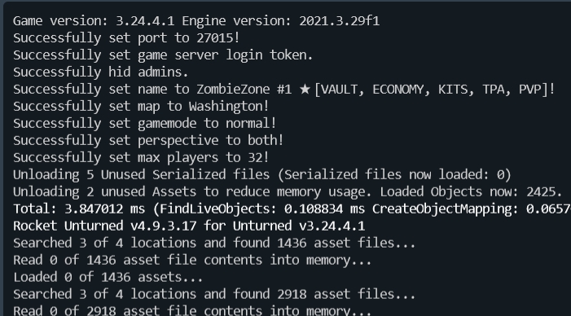

The **Commands.dat** file is key to setting up and customizing your Unturned server. It allows you to configure the server's map, name, slots, and other options. This guide provides a full list of commands for the **Commands.dat** file, along with descriptions of their functions and how to use them properly.

You'll find this file in the `Server/Commands.dat` directory of your server installation. For example, it might be located at:
```
Servers/unturned/Server/Commands.dat
```

All the commands in the **Commands.dat** are executed when the server starts before the map is loaded. 



Some of them can be executed while the server is running for example **maxplayers**.
Below is a complete list of commands for your **Commands.dat** file, with descriptions of what they do and how to use them and examples.

### Commands Table
| Name | Example | Description |
|------|---------|-------------|
| **bind** | `bind 127.0.0.1` | Sets the IP address of the server. |
| **chatrate** | `chatrate 0.5` | Sets the chat rate in seconds. Default is 0.25 and max value is 60. |
| **cheats** | `cheats` | Enables cheats if present, otherwise they are disabled. |
| **cycle** | `cycle 60` | Sets the cycle of the server in seconds. Default is 3600. |
| **filter** | `filter` | When used it rejects players with invalid characters in their name. |
| **gold** | `gold` | When used only players with Gold Upgrade DLC can join the server. |
| **loadout** | `loadout 255/2/3` | Sets the player loadout for the server. [Learn More](#loadout) |
| **maxplayers** | `maxplayers 24` | Sets the maximum number of players that can join the server. |
| **mode** | `mode easy` | Sets the difficulty of the server to `easy`, `normal`, or `hard`. |
| **name** | `name MyServer [KITS, TPA]` | Sets the name of the server. Cannot be longer than 50 characters. |
| **owner** | `admin 76561198285897058` | Sets the owner of the server, grants admin and blocks unadmin. |
| **password** | `password 1234` | Sets the password for the server. |
| **perspective** | `perspective both` | Sets the perspective of the server `first`, `third`, `vehicle`, or `both`. |
| **port** | `port 27015` | Sets the port of the server. |
| **pve** | `pve` | Enables PVE if used in the Commands.dat file. Otherwise PVP is enabled. |
| **queue_size** | `queue_size 32` | Sets the queue size of the server. Default is 8 and max value is 64. |
| **votify** | `/votify Y/300/300/60/60/8` | Sets the vote settings for the server. [Learn More](#votify) |
| **welcome** | `welcome Welcome to my server!` | Sets the welcome message for the server. |


### Loadout
The `loadout` command sets the skillset and items given to players when they first join the server or respawn.  
The first number is the skill set ID, and the following numbers are the item IDs. They must be separated by `/` slashes.

Examples:
- `loadout 255/2/3` - Sets the skillset set to All (255) and gives the player Work Jeans (2) and Orange Hoodie (3)
- `loadout 0/107/108/108/95` - Sets the skillset to Civilian (0) and gives the player an Ace (107), two Ace Clips (108) and one Bandage (95)
- `loadout 2/10/112` - Sets the skillset to Police Officer (2) and gives the player a Police Vest (10) and Bluntforce (112)

Useful links:
- [List of skillsets with IDs at official Unturned Wiki](https://unturned.wiki.gg/wiki/Skills#Skillsets)
- [List of vanilla items with IDs at uEdit.co](https://unturned.uedit.co/Unturned/Vanilla/Items/)

### Votify
The `votify` command sets the vote settings for the server. The parameters must be separated by `/` slashes and are as follows:
1. Vote Allowed (Y/N) - Whether voting is allowed on the server.
2. Pass Cooldown - The cooldown in seconds after a vote passes.
3. Fail Cooldown - The cooldown in seconds after a vote fails.
4. Vote Duration - The duration in seconds of the vote.
5. Yes Percentage - The percentage of yes votes required for the vote to pass.
6. Minimum Players - The minimum number of players required for a vote to start.

Examples:
- `votify Y/300/300/60/60/8` - Allows voting, with a pass and fail cooldown of 300 seconds, a vote duration of 60 seconds, a yes percentage of 60%, and a minimum of 8 players required to start a vote.
- `votify Y/120/90/30/70/4` - Allows voting, with a pass cooldown of 120 seconds, a fail cooldown of 90 seconds, a vote duration of 30 seconds, a yes percentage of 70%, and a minimum of 4 players required to start a vote.

### Video Tutorial
Check out our video tutorial on how to set the name for your server, change map and enable third person perspective. All by editing the Commands.dat file.

[video=938cade6-d826-4728-85e5-dae5f31f8331]