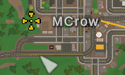

This is a list of vanilla player commands that can be used in-game on the server as an admin by typing them in the chat.

### Admin
The `admin` command is used to give a player admin blue hammer. Admin can use all commands and has access to all permissions.

**Syntax:** `/admin <player>`
- `<player>`: The name of the player to give admin to.

**Example:** `/admin MCrow`

### Unadmin
The `unadmin` command is used to remove admin blue hammer from a player.

**Syntax:** `/unadmin <player>`
- `<player>`: The name of the player to remove admin from.

**Example:** `/unadmin MCrow`

> **💡 PRO TIP**  
> Unfortunately there is no way to remove admin from someone who is offline. If you want you can delete all admins.  
Stop the server and delete the `Adminlist.dat` file which you will find in the same directory as `Commands.dat`.

### Ban
The `ban` command is used to ban a player from the server for a specified time.  

**Syntax:** `/ban <player> [reason] [time]`
- `<player>`: The name or Steam ID of the player to ban.
- `[reason]`: The reason for the ban.
- `[time]`: The duration of the ban in seconds. If not specified, the ban is permanent.

**Example:** `/ban MCrow "Griefing and cross-teaming" 3600`

> **💡 PRO TIP**  
> Remember to use the quotation marks for the reason if it has more than one word.

### Unban
The `unban` command is used to unban a player from the server. 

**Syntax:** `/unban <player>`
- `<player>`: The Steam ID of the player to unban.

**Example:** `/unban 76561198285897058`

> **💡 PRO TIP**  
> If you want to delete all bans from the server, stop the server and delete the `Blacklist.dat` file in the same directory as `Commands.dat`.

### Kick
The `kick` command is used to kick a player from the server.

**Syntax:** `/kick <player> [reason]`
- `<player>`: The name of the player to kick.
- `[reason]`: The reason for the kick.

**Example:** `/kick MCrow "Abusive language"`

### Spy
The `spy` command is used to take a screenshot of a player's screen. After using the command, you can view when you press the `ESC` key.

**Syntax:** `/spy <player>`
- `<player>`: The name of the player to spy on.

**Example:** `/spy MCrow`

### Day
The `day` command is used to change the time of the server to day.

**Syntax:** `/day`

### Night
The `night` command is used to change the time of the server to night.

**Syntax:** `/night`

### Weather
The `weather` command is used to change the weather of the server.

**Syntax:** `/weather <weather>`
- `<weather>`: The weather to set. Possible values are `none`, `disable`, `storm`, `blizzard` or you can specify a custom weather asset guid.

**Example:** `/weather storm`, `/weather 6c850687bdb947a689fa8de8a8d99afb`

> **💡 PRO TIP**  
> You can find the weather asset guids in the official [Unturned Wiki](https://unturned.wiki.gg/wiki/Weather).

### Time
The `time` command is used to change the time of the server.

**Syntax:** `/time <time>`
- `<time>`: The time to set in seconds. By default full day in Unturned is 1 hour, so 3,600 seconds.

**Example:** `/time 3200`

### Airdrop
The `airdrop` command is used to call an airdrop.

**Syntax:** `/airdrop`

### Say
The `say` command is used to send a message to all players on the server.

**Syntax:** `/say <message> [r] [g] [b]`

**Example:** `/say "Welcome to our server!" 255 0 0`

### Teleport
The `teleport` command is a complex command that can be used in different ways to teleport yourself or other players.

**Syntax:** `/teleport [player] [location]`
- `[player]`: The name of the player to teleport. If you want to teleport yourself, you can leave this field empty.
- `[location]`: The location to teleport to. It can be one of the following:
    - `player`: Name of the player to teleport to.
    - `bed`: Teleports the player to their bed.
    - `wp`: Teleports you to a waypoint, can only be used to teleport yourself.
    - `node`: Name of the node like city or other location. For example, `Seattle`, `Alberton`, `Airport`.

**Example:** `/teleport MCrow Seattle`, `/teleport bed`, `/teleport wp`, `/teleport Seattle`

> **💡 PRO TIP**  
> When using the `/teleport wp` command, you can set a waypoint by right clicking on the map to set a marker.
>
> 

### Video Tutorial

[video=8b1061f4-72c4-4417-91a8-6f884bfefbb6]