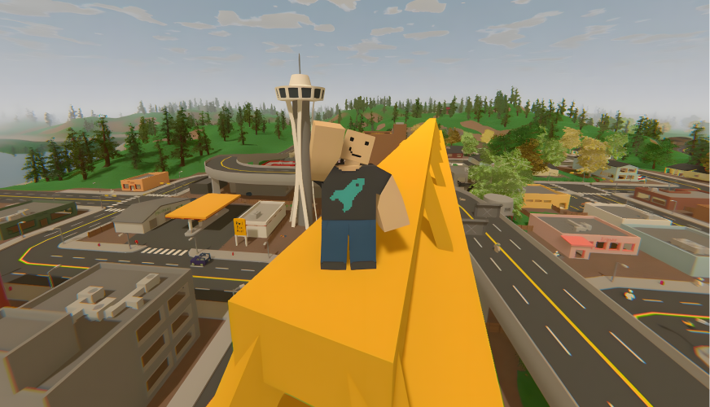

Starting your own Unturned server is a great experience. You can do it just to play with your friends by your own rules or open a public server and build a community.

Follow this documentation to learn all the necessary steps to start your own Unturned server.

### How to start?
In the next page you will learn how to set up Unturned server on your computer. This is the best way to start if you are new to hosting servers. You can play with your friends and learn how everything works and get your first hands-on experience.

After that I recommend getting a server from a third-party hosting provider. This way you can have your server online 24/7 and you can start building a community. 

Anyways, continue to the next and let's get started!

### Is it worth it?
If you want to host a server to play with friends, it's a great experience to be an admin on your own server. You should do it. You will get to know the game better and possibly decide to open a public server. 

Is making a public server worth it? Is anyone gonna play on it?

Over 20k unique players play Unturned every day on multiplayer servers according to [Battlemetrics](https://www.battlemetrics.com/servers/unturned/stats). At the same time, there are around 2,000 servers online. 

To be honest that's actually not a lot of players per server. However many of these servers are empty, inactive or not as good as they could be. If you make a good server and manage it well, you can eventually get a lot of players.

Don't be discouraged if you don't get many players at the beginning. It takes time to build a community and most people that fail just give up too early.

I have been running Unturned servers for over 9 years and I believe the key is persistence. My biggest mistake was that I renamed my servers too many times and tried too many different things. I should have just stuck to one name and one concept and kept improving it. That's my take on it.