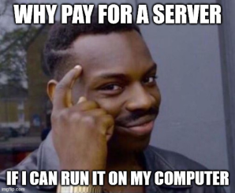

If you want to play with your friends, you can start a server on your own computer. This way you can play together for free. 

There are some downsides to this approach:
* Your friends can only play when you are online or your computer needs to be running all the time. 
* Your computer needs to be powerful enough to run the server and the game at the same time.
* You need to have a good internet connection.
* When your computer crashes or loses power, the server will go down and you and your friends might lose progress.

We don't recommend self hosting if you are planning to build a community. You should consider renting a server from a third-party hosting company that can run 24/7. Check out the next page to learn more about it.

Below you will find a step-by-step guide on how to make your own Unturned server on Windows. At the very bottom, you will find a video tutorial.

### Install Unturned Dedicated Server
Open Steam and in the store page search for "Unturned Dedicated Server".

Click on "Unturned Dedicated Server" and then click on "Play Now" button. You will be able to install it only if you have ever played Unturned before.

Select install location and press "Install". When it finishes installing, run it. It will open a console window and start loading the server. It finishes loading when you see "Loading level: 100%".

Don't close this window, it's your server console. When you close it, the server will stop. You can minimize it if you want.

### Join your server
To join your server, simply open Unturned go to Multiplayer. Then click on "All LAN" preset and your server should appear in the list. The default server name will be "Unturned".

### Invite your friends
To invite your friends, send them your Server Code that you can find in the console window. On Windows you can copy it by highlighting it with the mouse and right-clicking on your mouse.

> **💡 PRO TIP**  
> The server code changes every time your restart the server. If you want to keep the same server code, you need to register your server. Learn more about it in the **Making Server Public** page.

### Video Tutorial
Check out our video tutorial on how to make your first Unturned server on Windows and play with your friends.

[video=a164cae7-f592-4e12-9aa2-6aa570b97c25]
