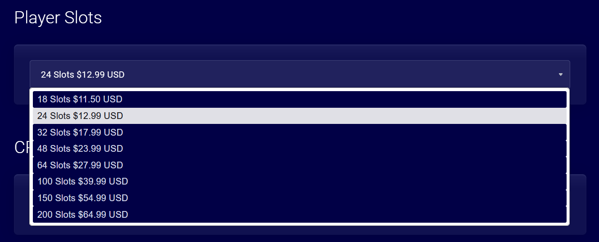

Third-party means that you are not hosting the server on your own computer or a dedicated machine. Instead, you are renting a server from a hosting company.  

Game server hosting companies provide you with a server that is already set up and ready to go. You don't need to worry about the technical stuff like port forwarding, DDoS protection, or server maintenance.

They give you access to a web-based control panel where you can manage and configure your server.

### Server Specs
The server specs depend on the map and the number of players. 

Ath the beginning we would recommend getting a server with at least 2GB of RAM and 1 CPU core. If you plan on hosting a server with large map and lots of mods, you might need more 3GB of RAM or more.

If you're buying from a hosting that sells Player Slots, we recommend getting a server with 24 slots. You can always upgrade it later if needed.

### Pricing
**How much does it cost?** It depends on the hosting company and the server's specs. You can find servers for as low as $5 per month, but the price can range up to $20 or more, depending on the limits and features.

Some hosting may seem more expensive, but they can have excellent support and offer more features. We recommend checking the reviews and asking for recommendations before buying.

### List of hosting companies
We made a list of some hosting companies that offer Unturned servers. 

* [Pine Hosting](https://pinehosting.com/unturned)
* [Bisect Hosting](https://www.bisecthosting.com/unturned-server-hosting)
* [Sparked Host](https://sparkedhost.com/unturned-hosting)
* [Wasabi Hosting](https://wasabihosting.com/store/unturned)
* [aSync Servers](https://host.asyncservers.com/index.php?rp=/store/unturned-servers)

We are not affiliated with any of them, so we can't recommend any. You should do your research and choose the one that fits your needs.